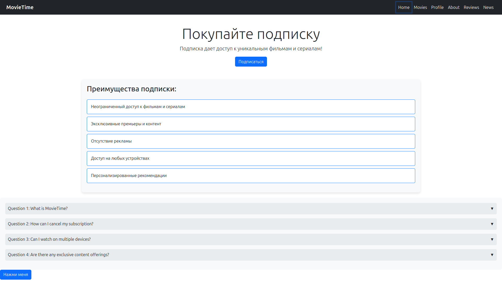
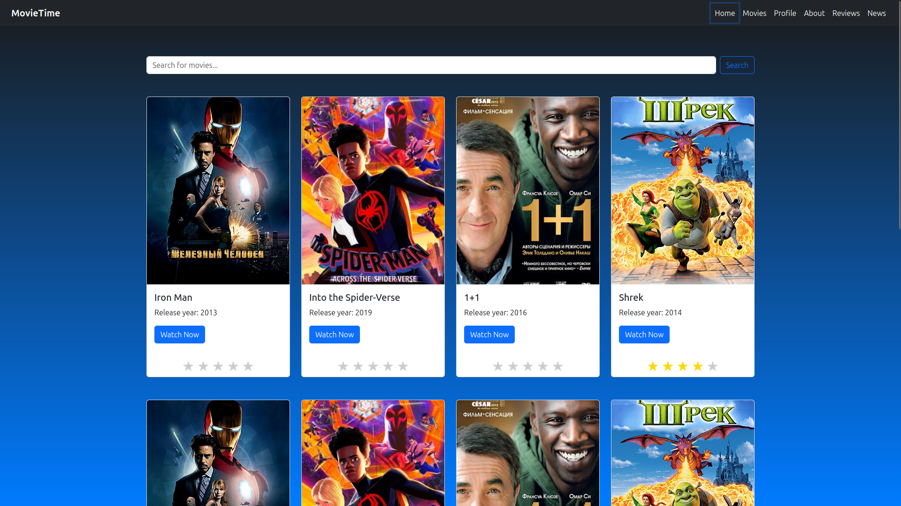
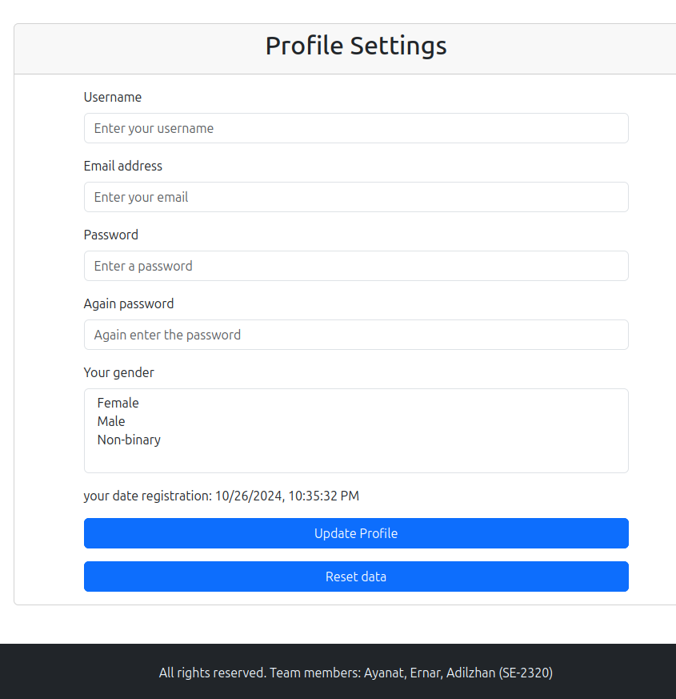

## MovieTime project :cinema:
Our project is a frontend web application that provides users with comprehensive information on any movie. With an intuitive and visually appealing interface, users can search for movies and access details such as plot summaries, cast, ratings, and more. This project demonstrates our potential and skill in frontend development by effectively combining responsive design, dynamic data rendering, and interactive components. We’ve applied our knowledge of HTML, CSS, and JavaScript to create a seamless user experience, showcasing our expertise in creating engaging and functional web applications.

## Technologies :tv:
- HTML
- CSS
- Bootstrap
- JS

## installation :arrow_down:
```
  git clone https://github.com/barcek2281/frontend-project.github.io.git
```
then open `index.html`

## Preview :eyes:
Homepage:
<br>
<br>

<br>
<br>
Movies page:
<br>

<br>
<br>
profile registration page:
<br>



### Participants :busts_in_silhouette:
[Khanaphin Ernar](https://github.com/bwjson), [Adilzhan Kurmet](https://github.com/Marticat) and [Zhunis Ayanat](https://github.com/barcek2281)'s assigment
